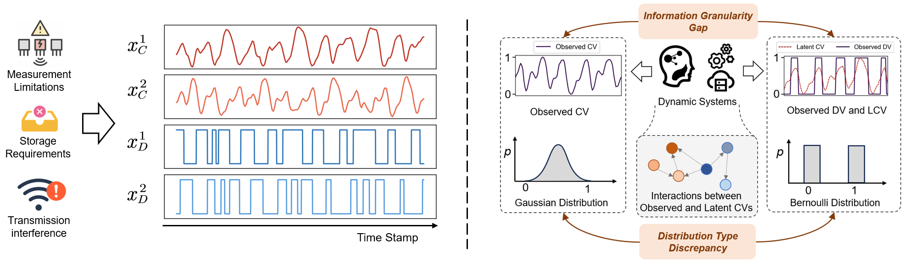
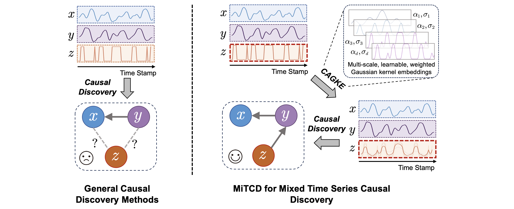
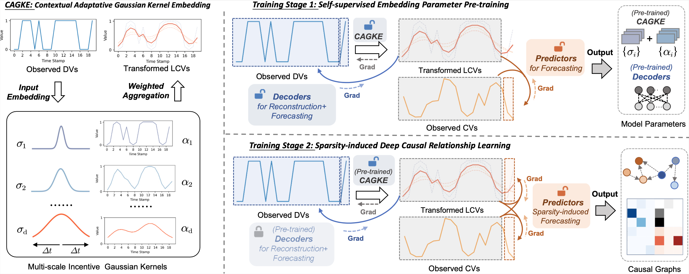
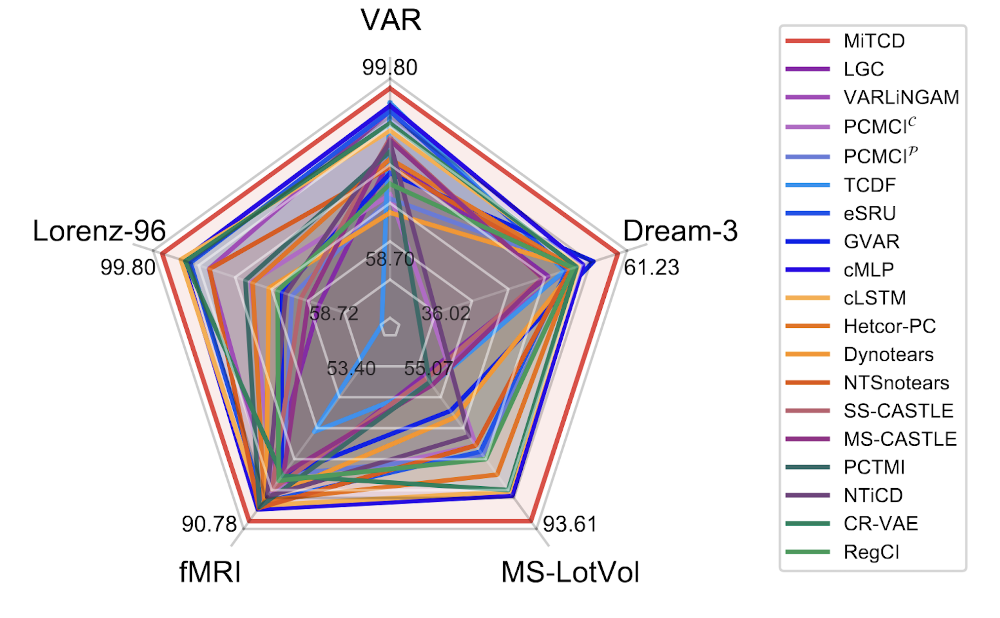
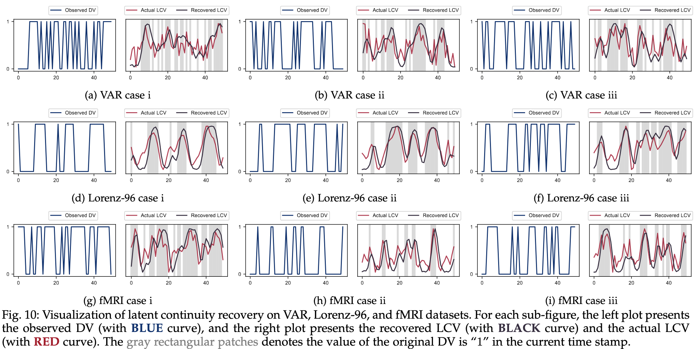

# Addressing Information Asymmetry: Deep Temporal Causality Discovery for Mixed Time Series

_This is the official implementation of **MiTCD** in *IEEE Transactions on Pattern Recognition and Machine Intelligence* 2025._

    ⛰️&nbsp;<a href="#-Mixed-Time-Series-Causal-Discovery">Mixed Time Series Causal Discovery</a>
    | 🚀&nbsp;<a href="#-MiTCD-Framework">MiTCD Framework</a>
    | ✅&nbsp;<a href="#-Setup">Setup</a>
    | 📊&nbsp;<a href="#-Train-and-Evaluation">Train and Evaluation</a>

🌟 **MiTCD is a mixed time series causal discovery framework, which adaptively recovers latent continuous variables (LCVs) from discrete variables (DVs) with the guidance of continuous variables (CVs) and performs causal discovery in a unified continuous-valued space, establishing state-of-the-art performance on five benchmarks in comparison with 18 strong and advanced baselines.**

## ⛰️ Mixed Time Series Causal Discovery
Mixed time series, encompassing both continuous variables (CVs) and discrete variables (DVs) are frequently encountered in practice yet underexplored in literature. Mixed time series presents the **_Information Asymmetry_** problem, which is caused by **the discrepancies in Information Granularity and Distribution Types between CVs and DVs**.

💡 The Information Asymmetry challenge impedes directly discovering causal relations among the observed mixed variables for general causal discovery methods. In comparison, MiTCD addresses the Information Asymmetry problem from the perspective of **_recovering the latent continuous variables from discrete variables under the guidance of observed continuous variables_**. 

## 🚀 MiTCD Framework
 
The architecture and its key components of MiTCD are shown below, including (1) **Contextual Adaptive Gaussian Kernel Embedding**, (2).**Training Stage 1: Self‐supervised Embedding Parameter Pre‐training** and (3). **Training Stage 2: Sparsity‐induced Deep Causal Relationship Learning**.

## ✅ Setup

### 1. Create conda environment(Optional)
~~~
conda create -n mitcd -y python=3.9.7 
conda activate mitcd
~~~

### 2. Install dependencies
Install the required packages
~~~
pip install -r requirements.txt
~~~

### 3. Prepare dataset
All the datasets used in our paper are publicly available and we put them in the file ./datasets

## 📊 Train and Evaluation

🏆 Empowered by the flexible latent continuity recovery and corresponding training strategies, **MiTCD achieves consistent state-of-the-art performance on five Granger causality benchmarks with mixed variables in comparison with 18 strong and advanced baselines**.

🔍  From the visualization plots, we find that **MiTCD can accurately recover the latent continuous variables** for discrete variables under the guidance of continuous variables, benefiting accurate and reliable estimations of causal structures.

We provide the experiment scripts for MiTCD under the folder ./scripts . You can reproduce the experiment results by the following scripts.

For VAR dataset：

~~~
mkdir -p ./result_mitcd/logs
python -u run_mitcd.py --dataname 'VAR' --length 200 --p 10 --disp 3 |tee ./result_mitcd/logs/VAR_200_10_3.log
python -u run_mitcd.py --dataname 'VAR' --length 500 --p 10 --disp 3 |tee ./result_mitcd/logs/VAR_500_10_3.log
python -u run_mitcd.py --dataname 'VAR' --length 1000 --p 10 --disp 3  |tee ./result_mitcd/logs/VAR_1000_10_3.log
python -u run_mitcd.py --dataname 'VAR' --length 2000 --p 10 --disp 3  |tee ./result_mitcd/logs/VAR_2000_10_3.log
~~~

For Lorenz-96 datasets:

~~~
mkdir -p ./result_mitcd/logs
python -u run_mitcd.py --dataname 'Lorenz' --length 1000 --p 10 --disp 4 --F 5 --dis_dim_pat 'random'  |tee ./result_mitcd/logs/Lorenz_1000_10_4_5.log
python -u run_mitcd.py --dataname 'Lorenz' --length 1000 --p 10 --disp 4 --F 10 --dis_dim_pat 'random'  |tee ./result_mitcd/logs/Lorenz_1000_10_4_10.log
python -u run_mitcd.py --dataname 'Lorenz' --length 1000 --p 10 --disp 4 --F 15 --dis_dim_pat 'random'  |tee ./result_mitcd/logs/Lorenz_1000_10_4_15.log
python -u run_mitcd.py --dataname 'Lorenz' --length 1000 --p 15 --disp 6 --F 5 --dis_dim_pat 'random'  |tee ./result_mitcd/logs/Lorenz_1000_15_6_5.log
python -u run_mitcd.py --dataname 'Lorenz' --length 1000 --p 15 --disp 6 --F 10 --dis_dim_pat 'random'  |tee ./result_mitcd/logs/Lorenz_1000_15_6_10.log
python -u run_mitcd.py --dataname 'Lorenz' --length 1000 --p 15 --disp 6 --F 15 --dis_dim_pat 'random'  |tee ./result_mitcd/logs/Lorenz_1000_15_6_15.log
python -u run_mitcd.py --dataname 'Lorenz' --length 1000 --p 20 --disp 8 --F 5 --dis_dim_pat 'random'  |tee ./result_mitcd/logs/Lorenz_1000_20_8_5.log
python -u run_mitcd.py --dataname 'Lorenz' --length 1000 --p 20 --disp 8 --F 10 --dis_dim_pat 'random'  |tee ./result_mitcd/logs/Lorenz_1000_20_8_10.log
python -u run_mitcd.py --dataname 'Lorenz' --length 1000 --p 20 --disp 8 --F 15 --dis_dim_pat 'random'  |tee ./result_mitcd/logs/Lorenz_1000_20_8_15.log
~~~

For fMRI datasets:

~~~
mkdir -p ./result_mitcd/logs
python -u run_mitcd.py --dataname 'fMRI' --p 10 --disp 4 --dis_dim_pat 'random' |tee ./result_mitcd/logs/fMRI_10_4_random.log
python -u run_mitcd.py --dataname 'fMRI' --p 10 --disp 5 --dis_dim_pat 'random' |tee ./result_mitcd/logs/fMRI_10_5_random.log
~~~

Also, you can specify GPU and tune other hyperparameters, e.g., adding:
~~~
--device 'cuda:1'  --lambda_sparse 0.05 --lr 0.001
~~~

